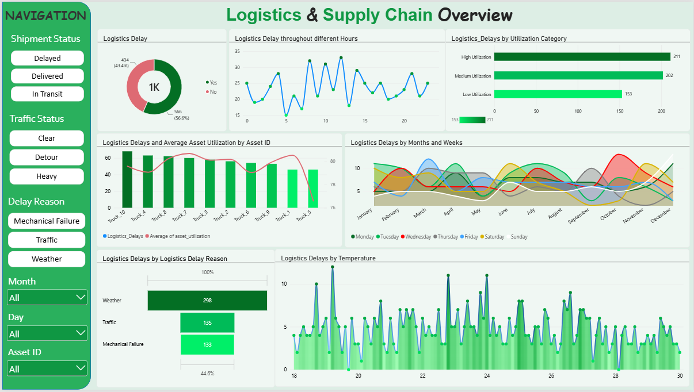

[readme_md.md](https://github.com/user-attachments/files/32452361/readme_md.md)
# Smart Logistics & Supply Chain Performance Analysis

An end-to-end analytical pipeline taking raw Smart Logistics & Supply Chain data, performing data cleaning and feature engineering in Python (Pandas), executing SQL querying with MySQL, and presenting interactive business insights using a Power BI Dashboard.

## Table of Contents

* [Project Overview](#project-overview)

* [Key High-Level Metrics](#key-high-level-metrics)

* [Dashboard Preview](#dashboard-preview)

* [Data Pipeline & Workflow Architecture](#data-pipeline--workflow-architecture)

* [SQL Analytical Insights & Query Results](#sql-analytical-insights--query-results)

  * [Fleet Asset Utilization & Performance](#fleet-asset-utilization--performance)

  * [Inventory Level Distribution & Stockout Risk](#inventory-level-distribution--stockout-risk)

  * [Temporal & Operational Bottlenecks](#temporal--operational-bottlenecks)

* [Key Takeaways & Recommendations](#key-takeaways--recommendations)

## Project Overview

This project evaluates performance metrics across 1,000 logistics tracking records recorded in the Smart Logistics & Supply Chain dataset from Kaggle. The goal of this analysis is to evaluate key operational metrics, identify delay drivers, assess stockout risks, and optimize fleet performance.

## Key High-Level Metrics

* **Total Logistics Records Analyzed:** 1,000 records

* **Total Unique Assets Tracked:** 10 Trucks

* **On-Time Deliveries:** 434 records (56.60% Logistics Delay Rate)

* **Average Asset Utilization:** 79.60%

* **Average Inventory Level:** 297.92 units

* **Average Demand Forecast:** 199.28 units

## Dashboard Preview

## Data Pipeline & Workflow Architecture

1. **Data Ingestion:** Loaded `smart_logistics_dataset.csv` containing 1,000 records across 16 initial columns.

2. **Data Cleaning & Wrangling (Python/Pandas):**

   * Imputed 263 missing values in the `logistics_delay_reason` column using the mode.

   * Standardized column headers to `lower_snake_case` for seamless SQL database querying.

3. **Feature Engineering:**

   * Categorized Asset Utilization: Low Utilization (60–70%), Medium Utilization (71–85%), and High Utilization (86–100%).

   * Categorized Purchase Frequency: Low, Medium, High.

   * Extracted temporal metrics (`month_name`, `month`, `week`, `day`, `day_of_week`, `hour`, and `date`) from the timestamp column.

4. **Database Management (MySQL):** Stored cleaned data and executed queries to analyze asset health, inventory levels, and bottleneck trends.

5. **Interactive Visualization (Power BI):** Designed a dynamic dashboard to visually represent operational performance and risk metrics.

## SQL Analytical Insights & Query Results

### Fleet Asset Utilization & Performance

Analysis of 10 tracked assets sorted by utilization rate:

* **Truck_7:** 80.67% Avg Utilization | 29,602 Total Inventory Level | 58.82% Delay Rate

* **Truck_1:** 80.52% Avg Utilization | 25,791 Total Inventory Level | 51.69% Delay Rate

* **Truck_8:** 80.24% Avg Utilization | 35,192 Total Inventory Level | 56.88% Delay Rate

* **Truck_2:** 80.16% Avg Utilization | 30,912 Total Inventory Level | 53.33% Delay Rate

* **Truck_3:** 80.10% Avg Utilization | 26,101 Total Inventory Level | 62.37% Delay Rate

* **Truck_9:** 79.94% Avg Utilization | 26,791 Total Inventory Level | 56.38% Delay Rate

* **Truck_10:** 79.58% Avg Utilization | 32,876 Total Inventory Level | 64.76% Delay Rate

* **Truck_4:** 79.06% Avg Utilization | 31,266 Total Inventory Level | 58.88% Delay Rate

* **Truck_6:** 79.03% Avg Utilization | 30,618 Total Inventory Level | 52.43% Delay Rate

* **Truck_5:** 76.60% Avg Utilization | 28,766 Total Inventory Level | 49.46% Delay Rate

### Inventory Level Distribution & Stockout Risk

Distribution across inventory tiers:

* **High Inventory (300+ units):** 49.50% Record Share | 55.76% Delay Rate

* **Medium Inventory (151–300 units):** 38.50% Record Share | 58.44% Delay Rate

* **Low Inventory (1–150 units):** 12.00% Record Share | 54.17% Delay Rate

*Stockout Risk Note: Identified critical instances where actual inventory levels fell below forecasted demand.*

### Temporal & Operational Bottlenecks

* **Peak Delay Month:** July recorded the highest delay occurrences with a total of 54 delays.

* **Peak Delay Day:** Tuesday recorded the highest average delay rate at 65.00%.

* **Peak Operational Hours:** Delays peaked during morning hours:

  * 12:00 PM: 33 delays

  * 08:00 AM: 32 delays

  * 10:00 AM: 31 delays

## Key Takeaways & Recommendations

1. **Service & Re-route High-Stress Trucks:** Trucks such as Truck_3, Truck_7, and Truck_8 operate above 80% utilization and face delay rates exceeding 56%. Schedule immediate maintenance and reassign them to lighter, less congested routes.

2. **Dynamic Inventory Buffers:** Implement automated reorder points whenever forecasted demand exceeds available inventory levels to eliminate stockout occurrences.

3. **Avoid Rush Hours & Peak Days:** Restructure logistics schedules to restrict non-urgent shipments during peak bottleneck times (8:00 AM – 12:00 PM) and on Tuesdays. Shift affected deliveries to late afternoons or lower-volume days.
